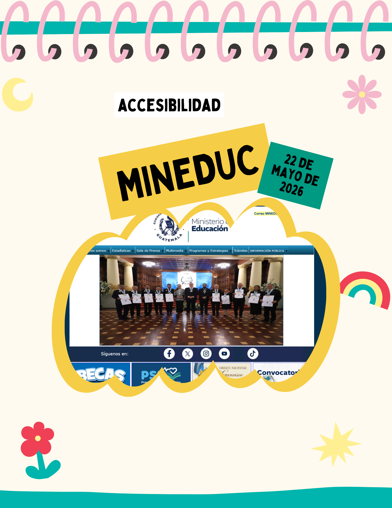
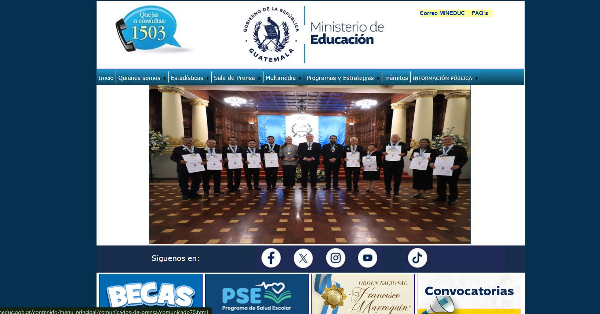
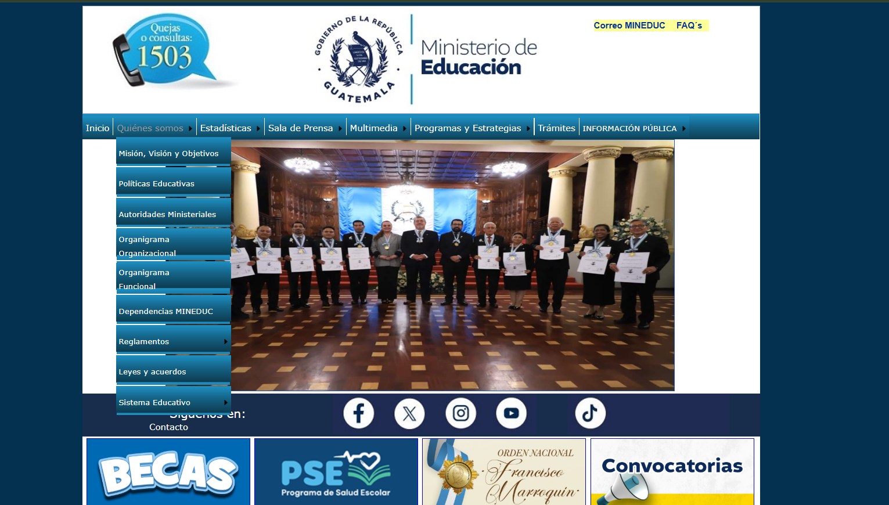
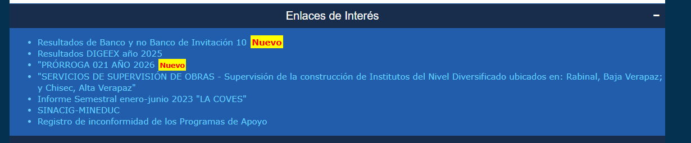
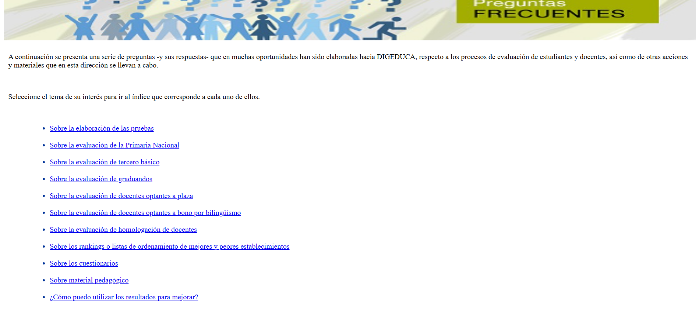

# Entrada 01: Sitio web del Ministerio de Educación y problemas de accesibilidad

## Categoría

Accesibilidad

## Fecha de observación

22 de mayo de 2026

## Interfaz analizada

Sitio web oficial del Ministerio de Educación de Guatemala

## Contexto
Intenté utilizar el sitio web del MINEDUC, incluyendo el menú principal, apartados informativos y páginas internas

Encontré muchos problemas relacionados con accesibilidad y facilidad de uso, especialmente para personas mayores o con limitaciones visuales.

## Problema identificado

Uno de los principales problemas es la navegación del menú. Los submenús solo aparecen si el usuario coloca el mouse exactamente sobre ciertas partes del texto, lo cual hace difícil navegar, especialmente para personas que no están acostumbradas al uso de computadoras.

Además, al seleccionar varias opciones el sitio abre nuevas páginas y cambia completamente la navegación, haciendo que el usuario se pierda fácilmente.

También hay problemas fuertes de contraste. En varias secciones utilizan letras celestes sobre fondos azules oscuros, lo cual dificulta mucho la lectura para personas con baja visión o daltonismo.

Otro problema es que la página no responde bien cuando se aumenta el tamaño de la letra o se usa zoom en el navegador. Parte de la información se desordena o deja de verse correctamente.

Finalmente, considerando que estamos en Guatemala y el sitio pertenece al Ministerio de Educación, sería importante que la información estuviera disponible también en idiomas mayas para mejorar la accesibilidad cultural y lingüística.

## Principios de accesibilidad relacionados

### 1. Perceptible

La información no siempre es fácil de percibir debido al bajo contraste entre colores y al tamaño pequeño de algunas letras.

### 2. Operable

El menú desplegable requiere mucha precisión con el mouse, haciendo complicada la navegación para personas mayores o con dificultades motoras.

### 3. Comprensible

La navegación puede resultar confusa porque el sitio cambia constantemente de páginas y abre distintas secciones sin mantener una estructura clara.

### 4. Robusto

La página no responde bien cuando el usuario intenta usar herramientas de accesibilidad como zoom o aumento del tamaño del texto. No es responsive. 

## Problemas específicos encontrados

- Menús difíciles de desplegar.
- Bajo contraste entre texto y fondo.
- Texto pequeño en varias secciones.
- Mala adaptación al aumentar el zoom.
- Sitio poco responsive.
- Navegación confusa entre páginas.
- Ausencia de idiomas mayas.
- Mucha información agrupada visualmente.

## Reflexión

Una página de alta importancia como el del Ministerio de Educación debería priorizar mucho más la accesibilidad.

La información pública debe poder ser utilizada por cualquier persona sin importar su edad, nivel tecnológico o condición visual.

Actualmente el sitio puede resultar complicado incluso para usuarios que sí tienen experiencia usando sitios web. 
## Posible mejora

Algunas mejoras importantes serían:

- Mejorar el contraste entre colores. 
- Actualizar paleta de colores. 
- Permitir aumentar el tamaño del texto sin romper la página.
- Hacer los menús más fáciles de usar.
- Agregar bien los enlaces. 
- Mejorar la adaptación a dispositivos móviles.
- Agregar versiones en idiomas mayas.

