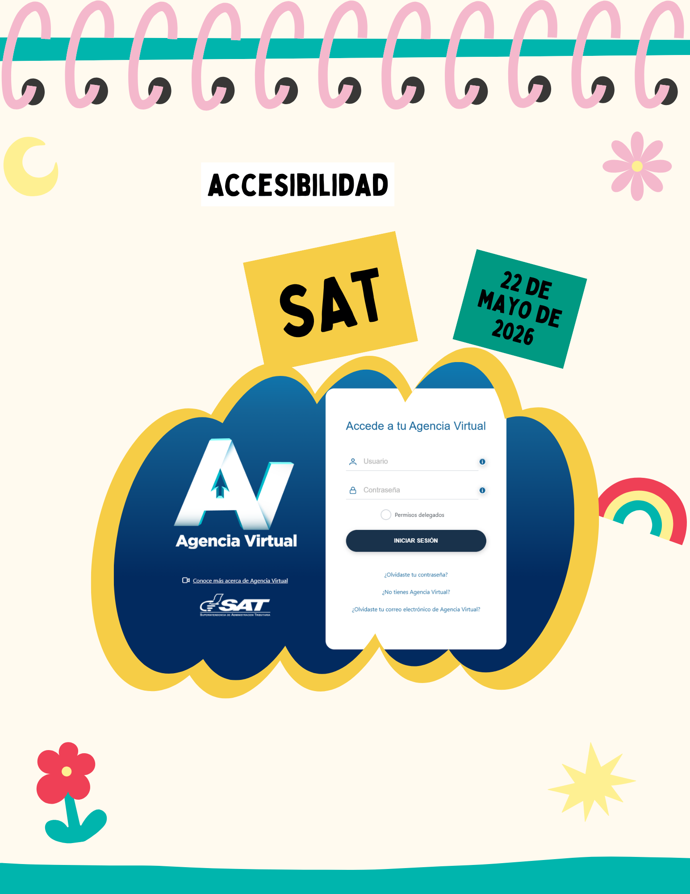
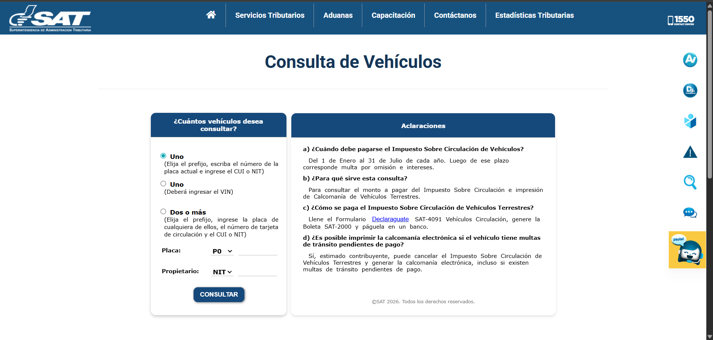
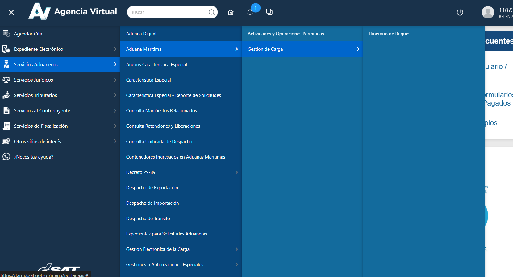
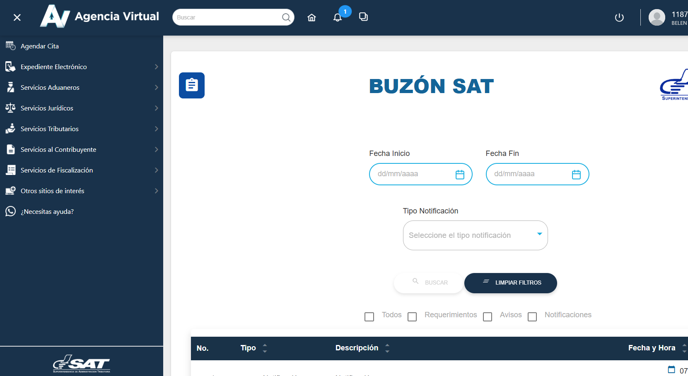
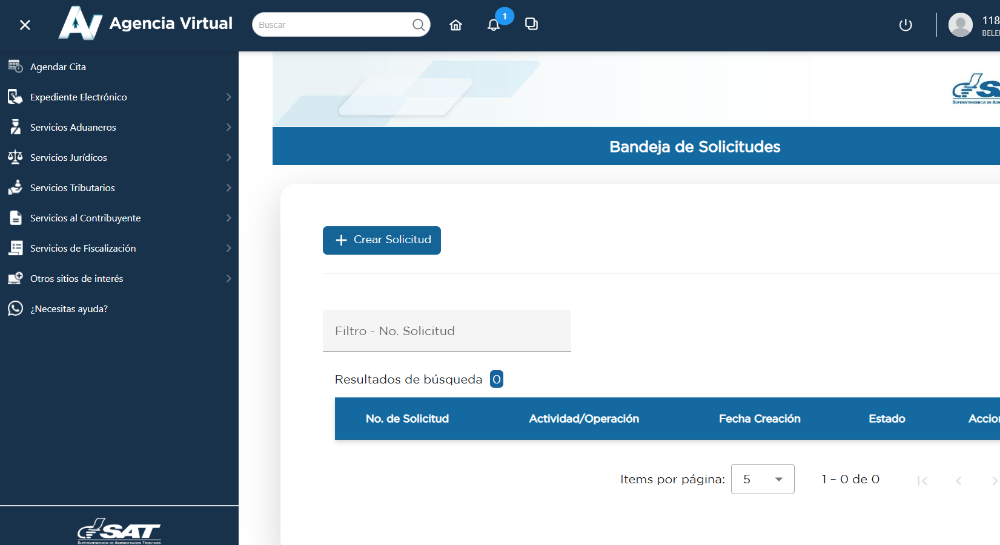

# Entrada 02: Sitio web de SAT y problemas de accesibilidad

## Categoría

Accesibilidad

## Fecha de observación

22 de mayo de 2026

## Interfaz analizada

Agencia Virtual SAT Guatemala

## Contexto

Intentpé utilizar la Agencia virtual. Navegarla puede ser bastante complicado. Hay muchos menús, submenús y opciones que no siempre son fáciles de encontrar. 

## Problema identificado

Los menús tienen demasiadas opciones y varias aparecen hasta que colocas el mouse encima. Esto hace que la navegación sea difícil para personas mayores, personas con poca experiencia tecnológica o personas con dificultades motoras.

También me di cuenta que la página no se adapta bien en tamaño de tablet. Algunos elementos se rompen, quedan cortados o se vuelven incómodos de usar.

Otro problema es que las notificaciones son difíciles de encontrar porque se tienen que filtrar por fecha. Si una persona no sabe exactamente qué fecha buscar, puede perder mucho tiempo intentando encontrar la información.

Además, considero que una página pública en Guatemala siempre debería estar disponible en idiomas mayas. Al ser una institución importante para trámites ciudadanos, no tener opciones de idioma hace que sea menos inclusiva.

## Principios de accesibilidad relacionados

### 1. Perceptible

La información no siempre se presenta de forma clara. Algunos menús tienen muchas opciones juntas y esto hace difícil identificar rápidamente lo importante.

### 2. Operable

La página depende mucho del uso preciso del mouse para desplegar menús.

### 3. Comprensible

La estructura de la página puede ser confusa porque hay demasiadas categorías, subcategorías y filtros. Esto hace que el usuario tenga que adivinar dónde está la información.

### 4. Robusto

El sitio no responde bien en ciertos tamaños de pantalla, como tablet. Esto afecta la experiencia de personas que no usan computadora de escritorio.

## Problemas específicos encontrados

- Demasiados menús y submenús.
- Opciones que aparecen solo al pasar el mouse.
- Navegación complicada para usuarios con poca experiencia.
- Diseño poco responsive en tablet.
- Notificaciones difíciles de encontrar.
- Filtros por fecha poco intuitivos.
- Falta de versiones en idiomas mayas.

## Reflexión

Para mí la página de la SAT demuestra que la accesibilidad no solo significa que una página funcione, sino que cualquier persona pueda entenderla y usarla sin demasiada dificultad.

Una institución pública debería facilitar los trámites, no hacer que el usuario se pierda entre muchas opciones.

También considero que en Guatemala la accesibilidad lingüística es muy importante, porque no todas las personas tienen el español como idioma principal.

## Posible mejora

Una mejora sería simplificar los menús y hacer que las opciones principales estén visibles sin depender tanto del mouse.

También sería útil mejorar el diseño responsive para tablets y celulares, agregar una búsqueda más clara para notificaciones y permitir encontrar información sin depender tanto de fechas exactas.

Finalmente, sería importante incluir versiones en idiomas mayas para que el sitio sea más accesible e inclusivo.