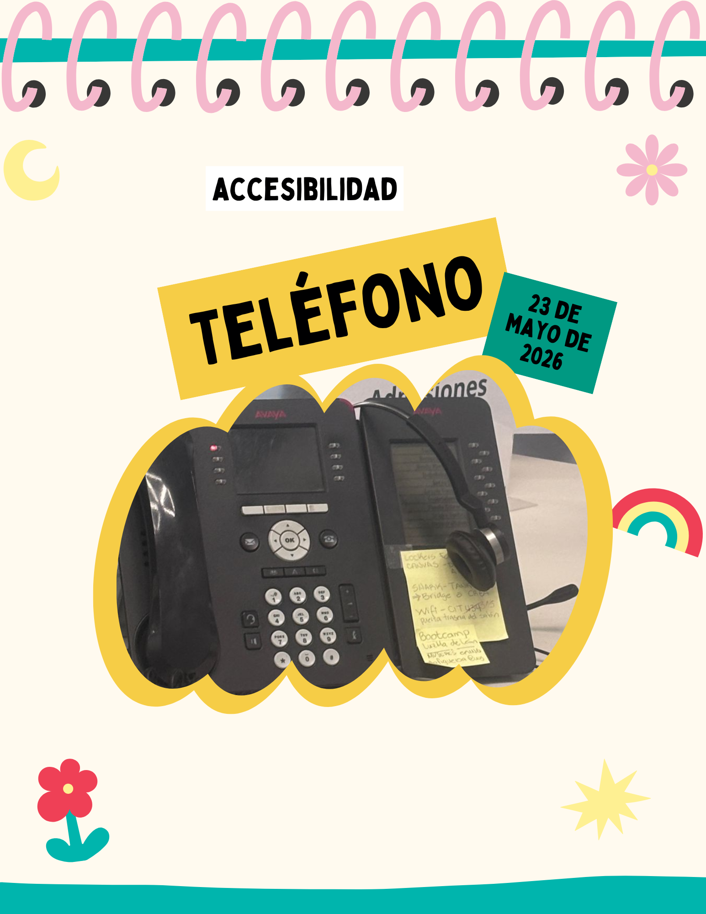
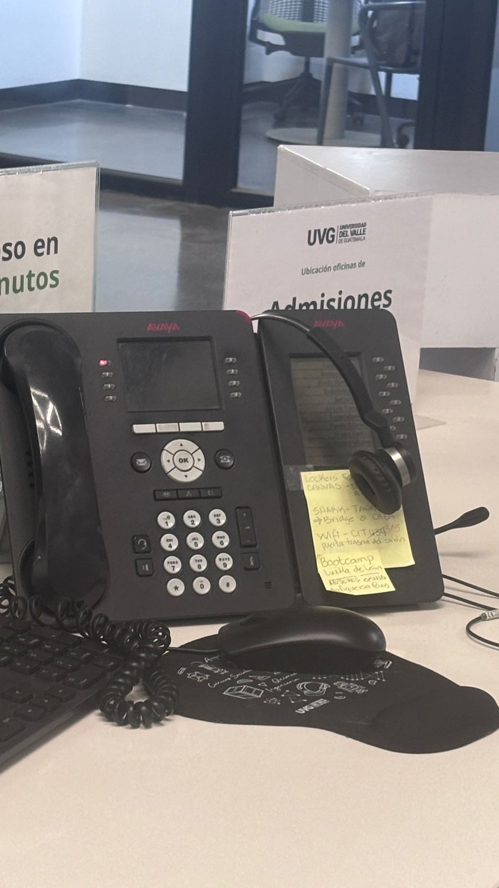

# Entrada 03: Teléfono de oficina 

## Categoría

Accesibilidad

## Fecha de observación

23 de mayo de 2026

## Objeto analizado

Teléfono de oficina 

## Contexto

Observé un teléfono de oficina utilizado en una recepción. Aunque funciona para la mayoría de personas, considero que no toma en cuenta las diferencias individuales de usuarios con limitaciones visuales o dificultades motoras.

## Problema identificado

El teléfono no cuenta con braille ni con algún sistema táctil que ayude a identificar los botones. Esto significa que una persona con discapacidad visual tendría que memorizar o adivinar la ubicación de las funciones.

También hay botones y los iconos son bastante pequeños y están muy juntos. Esto puede hacer difícil distinguir las acciones correctamente, especialmente para personas mayores o usuarios con problemas de visión.

Además, algunas funciones dependen de leer texto pequeño en la pantalla, lo cual puede complicar todavía más la experiencia para alguien con baja visión.

## Principios de accesibilidad relacionados

### 1. Perceptible

La información visual no es fácil de percibir para todos los usuarios. Los botones tienen texto pequeño y no existe retroalimentación táctil clara.

### 2. Operable

Los botones están demasiado juntos y pequeños, lo cual dificulta utilizarlos correctamente sin presionar otros por accidente.

### 3. Comprensible

Las funciones no son intuitivas para alguien que no puede ver los símbolos o leer la pantalla fácilmente.

### 4. Inclusión

El diseño asume que todos los usuarios pueden ver correctamente, dejando fuera a personas con discapacidad visual.

## Problemas específicos encontrados

- No cuenta con braille.
- Botones pequeños.
- Íconos difíciles de distinguir.
- Botones muy juntos.
- Pantalla con texto pequeño.
- No existe ayuda auditiva.
- Difícil de usar para personas con baja visión.

## Reflexión

Ete tipo de teléfonos demuestra cómo muchos dispositivos todavía son diseñados pensando únicamente en usuarios sin discapacidades. No todos los individuos tienen las mismas capacidades y los diseñadores los limitan. 

Sería importante que el teléfono sea más inclusivos para que cualquier persona pueda utilizarlos de manera independiente.

## Posible mejora

Algunas mejoras podrían ser:

- Agregar braille en botones importantes.
- Hacer botones más grandes y separados.
- Utilizar iconos más claros y visibles.
- Permitir asistencia por voz para ciertas funciones.