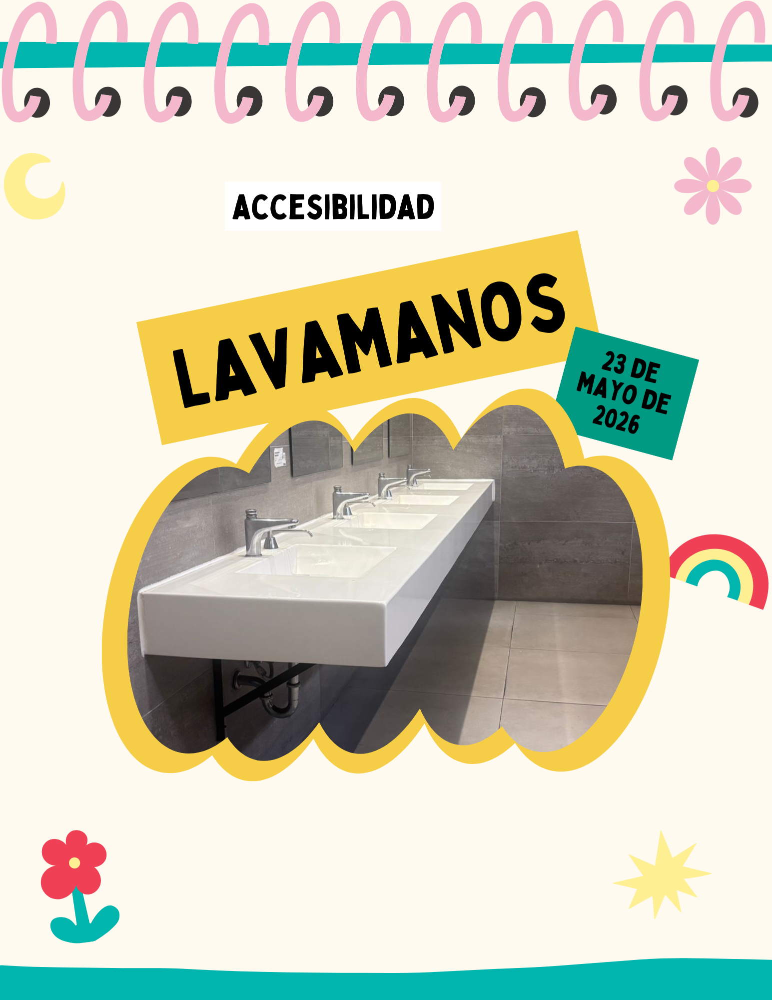
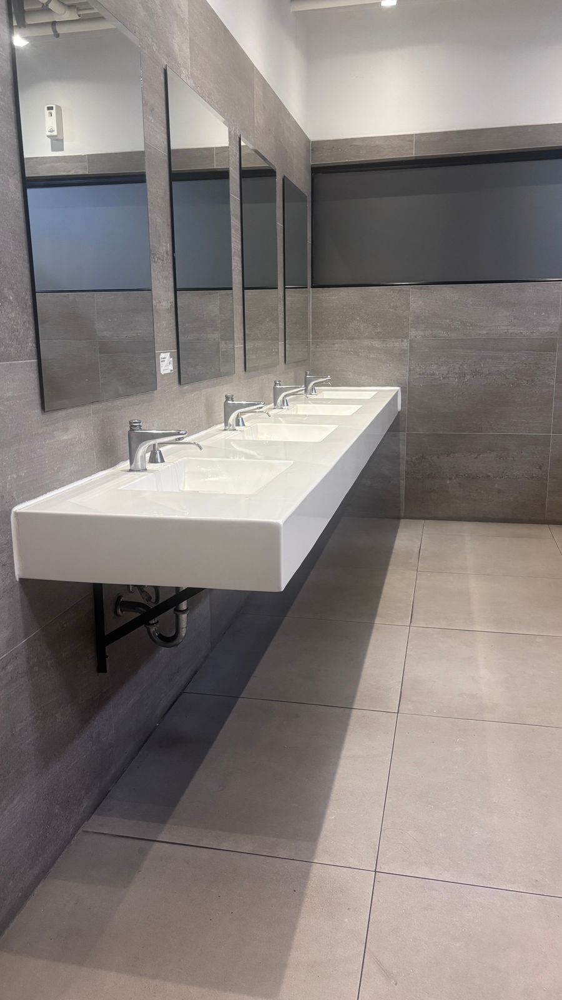

# Entrada 04: Lavamanos y problemas de accesibilidad

## Categoría

Accesibilidad

## Fecha de observación

23 de mayo de 2026

## Objeto analizado

Lavamanos de baño de UVG

## Contexto

Hoy observé los lavamanos de un baño dentro de la universidad. No toma en cuenta las diferencias físicas entre las personas.

## Problema identificado

El lavamanos está diseñado pensando únicamente en personas de altura promedio. Esto hace que no sea accesible para personas de talla baja, niños o algunas personas usuarias de silla de ruedas.

Aunque existen baños en UVG adaptados para silla de ruedas, los lavamanos no. La altura puede dificultar alcanzar el grifo y el jabón.

## Principios de accesibilidad relacionados

### 1. Inclusión

El diseño no considera diferentes tipos de cuerpos ni necesidades físicas distintas.

### 2. Operable

El lavamanos puede ser difícil de utilizar para personas que no alcanzan fácilmente la superficie o el grifo.

### 3. Equidad de uso

No todas las personas pueden utilizarlo de la misma manera o con la misma comodidad.

### 4. Diseño universal

El objeto fue pensado para un usuario promedio y no para la diversidad real de personas que utilizan el espacio.

## Problemas específicos encontrados

- Lavamanos demasiado alto.
- Difícil acceso para personas de talla baja.
- Incomodidad para algunos usuarios de silla de ruedas.
- Los niños no pueden utilizarlo.
- Espejos colocados muy arriba.
- No existen opciones de diferentes alturas.
- Diseño poco inclusivo.

## Reflexión

Considero que muchas veces se piensa en accesibilidad solo como poner una rampa o un baño especial, pero realmente también deberían diseñarse los objetos cotidianos para diferentes tipos de usuarios.

Un espacio verdaderamente accesible debería permitir que cualquier persona pueda usarlo cómodamente sin depender de ayuda externa.

## Posible mejora

Algunas posibles mejoras serían:

- Colocar al menos un lavamanos más bajo.
- Considerar mejor el acceso para silla de ruedas.
- Aplicar principios de diseño universal desde el inicio.