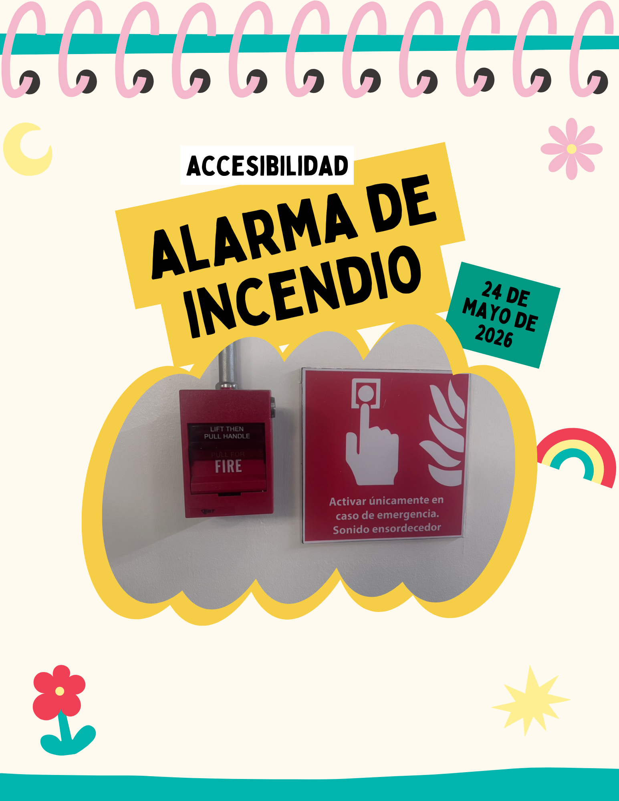
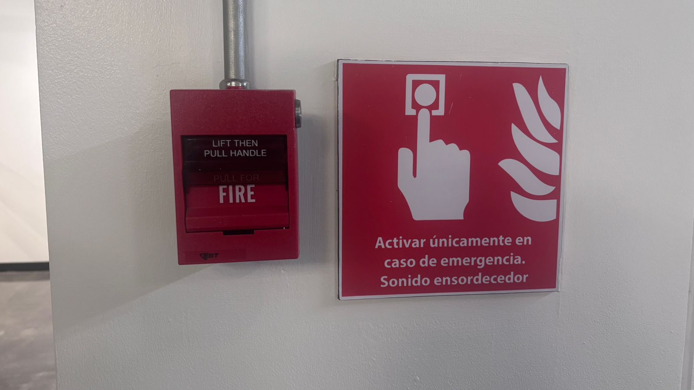

# Entrada 05: Alarma contra incendios

## Categoría

Accesibilidad

## Fecha de observación

24 de mayo de 2026

## Objeto analizado

Interruptor de alarma contra incendios de UVG 

## Contexto

Una de las alarmas contra incendios ubicada dentro de la universidad. Aunque el objeto sí incluye una señal en español indicando que debe activarse únicamente en caso de emergencia, las instrucciones principales de uso del interruptor están únicamente en inglés.

## Problema identificado

El dispositivo tiene escrito “LIFT THEN PULL HANDLE” y “PULL FOR FIRE”, pero no existe una traducción directa al español en el mecanismo.

Esto representa un problema de accesibilidad para el contexto guatemalteco, ya que no todas las personas hablan inglés. En una emergencia cualquier persona podría necesitar usar la alarma, como estudiantes, personal administrativo, policías, visitantes o trabajadores de mantenimiento.

En un momento de estrés o pánico, depender de que la persona entienda inglés hace más difícil utilizar correctamente el dispositivo.

La mayoría de la población UVG sabe inglés pero hay una parte de la población que no, y esto debería tomarse en cuenta. Ya que inclusive estudiantes pueden no entender cómo utilizarlo y tener que hacerlo por instinto en caso de incendio.

## Principios de accesibilidad relacionados

### 1. Comprensible

La información importante debería ser fácil de entender para todas las personas.

### 2. Inclusión

El diseño asume que todos los usuarios comprenden inglés, lo cual no refleja la realidad del contexto guatemalteco.

### 3. Accesibilidad cultural y lingüística

Los objetos de seguridad deberían adaptarse al idioma principal de las personas que utilizan el espacio.

### 4. Seguridad de uso

En una emergencia las instrucciones deben ser inmediatas y claras, sin necesidad de traducir mentalmente.

## Problemas específicos encontrados

- Instrucciones principales únicamente en inglés.
- Falta de traducción directa al español.
- Puede generar confusión en una emergencia.
- No considera diferencias lingüísticas dentro del país.
- La accesibilidad depende de saber inglés.

## Reflexión

Considero que en Guatemala los sistemas de emergencia deberían priorizar instrucciones claras en español y, si es posible, también usar símbolos para las personas no letradas. 

Aunque muchas personas dentro de la UVG saben inglés, no toda la comunidad universitaria lo habla. En una situación de emergencia el diseño debería ayudar a reaccionar rápido y no obligar a interpretar otro idioma o acudir al instinto.

## Posible mejora

Algunas posibles mejoras serían:

- Agregar instrucciones también en español.
- Diseñar señales pensando en el contexto real del país.
- Hacer que las instrucciones sean entendibles incluso sin conocer inglés.