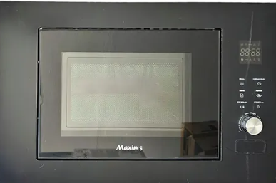

# Entrada 01: Microondas con panel poco intuitivo

## Categoría

Diseño de las cosas cotidianas

## Fecha de observación

19 de mayo de 2026

## Objeto analizado

Microondas con panel digital y botones confusos. 

## Contexto

Al observar este microondas, me pareció que cumple con su función principal de calentar alimentos pero su es complicadísimo y poco intuitivo. 

A simple vista, el panel donde se ingresa el tiempo tiene varios botones pequeños, símbolos y funciones que no son fáciles de identificar rápidamente.

Tines que probar varias veces para lograr calentar algo. 

## Problema identificado

El principal problema que identifiqué fue el diseño del panel que no se ve de forma clara cuáles son las acciones más importantes. 

Para una tarea tan básica, como calentar comida debería ser fácil identificar la función de los botones. 

Además, los botones tienen poco contraste visual.

## Principios de diseño relacionados

### Visibilidad

Según Don Norman, un buen diseño debe permitir que el usuario entienda qué acciones son posibles sin necesidad de pensarlo demasiado. Las funciones del microondas no son completamente visibles ni evidentes para mí, ya que los botones se ven similares entre sí y no destacan las acciones más usadas.

## Reflexión

Para mí este microondas es un ejemplo de cómo querer hacer algo minimalista no siempre mejora la experiencia del usuario. Aunque el producto puede tener apariencia visual bonita, el diseño no ayuda a usar el microondas. 

## Posible mejora

Una mejora sería separar las funciones principales de las secundarias. También sería bueno aumentar el tamaño de los botones más importantes y usar textos o íconos más claros.

Por ejemplo, el botón de inicio rápido podría ser más grande y estar cerca del botón de inicio. 