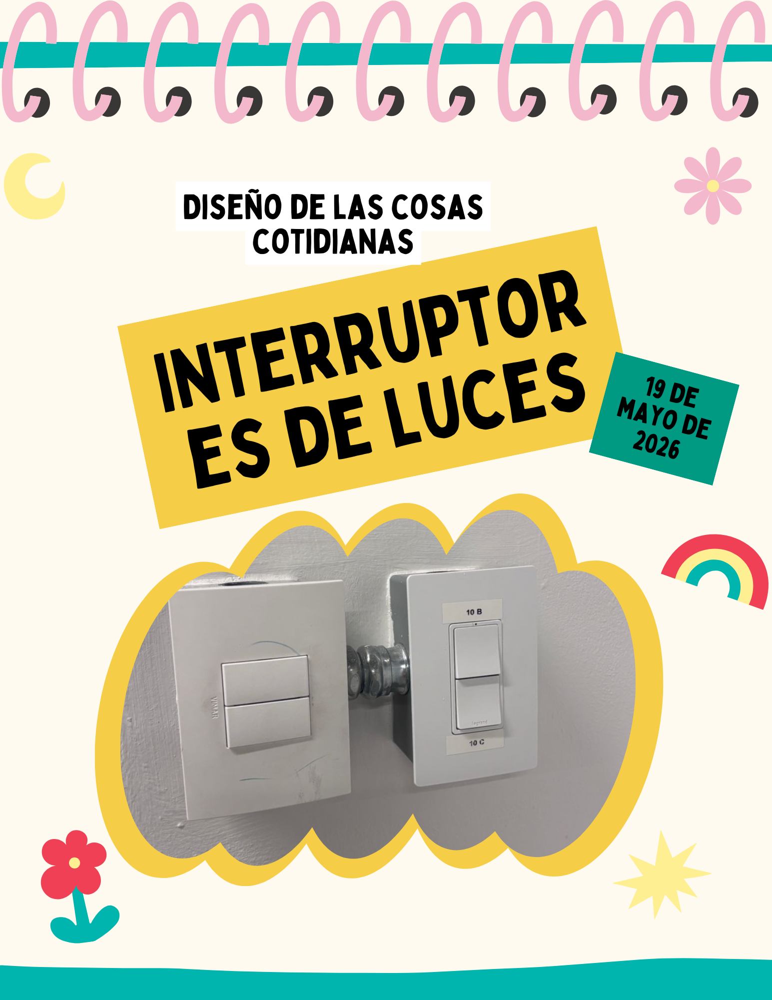
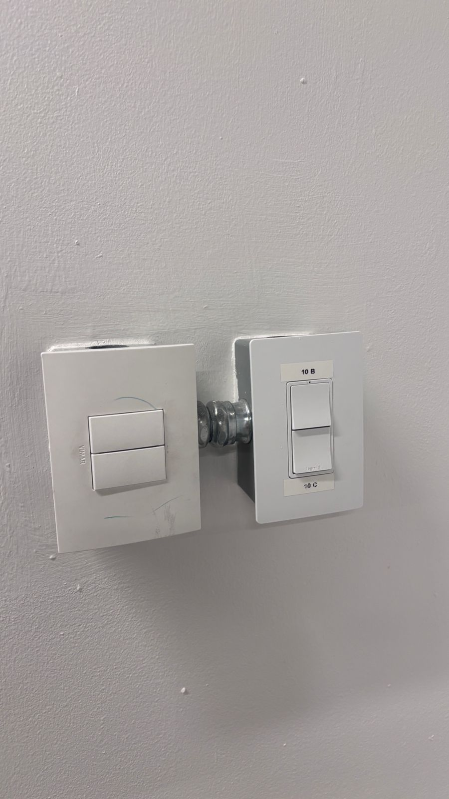

# Entrada 02: Interruptores de luces

## Categoría

Diseño de las cosas cotidianas

## Fecha de observación

19 de mayo de 2026 

## Objeto analizado

Interruptores de luces de un salón de clases.

## Contexto

Estos interruptores controlan las luces de los salones de las clases de la UVG, pero el problema es que existen distintos modos de iluminación y no hay ninguna indicación clara de cómo activarlos.

Cada vez que queremos cambiar las luces, tanto los estudiantes como los catedráticos terminamos probando varias combinaciones entre interruptores para descubrir qué configuración queremos usar.

Incluso en la imagen se puede ver que alguien colocó etiquetas con tape para intentar identificar mejor los controles.

## Problema identificado

El principal problema es que el sistema no comunica claramente qué hace cada interruptor ni cómo funcionan juntos.

Tenemos que aprender por prueba y error qué combinación activa cada modo de luces, lo cual hace que una acción tan simple como encender unas lices se vuelva confusa.

Además, no existe retroalimentación visual que explique qué modo está activo o cuál interruptor corresponde a cada grupo de luces.

## Principios de diseño relacionados

### Visibilidad

Según Don Norman, un diseño debe mostrar claramente las acciones posibles. En este caso, los interruptores no indican qué luces controlan ni cómo interactúan entre sí.

### Correspondencia entre controles y función

No existe una indicación de cómo activar cada modo. Esto obliga a todos a experimentar varias veces antes de lograr el objetivo.

### Reconocimiento sobre memoria

Jakob Nielsen indica en sus análisis que un sistema debe ayudar a las personas a reconocer funciones en lugar de obligarlo a memorizar. En este caso, todos terminamos en este proceso de memorizar porque el diseño no comunica qué hace cada interruptor.

## Reflexión

Para mí este es un buen ejemplo de cómo un diseño está mal implementado. Aunque visualmente los interruptores se ven limpios y modernos, realmente no ayudan a entender cómo controlar las luces. 

Este es un caso distinto al de un interruptor normal ya que las luces tiene varias combinaciones y cada interruptor controla distintas luces. 

El hecho de que alguien pusiera etiquetas manualmente demuestra que el diseño original no comunica bien su función.

## Posible mejora

Una mejora sería agregar etiquetas claras indicando qué luces controla cada interruptor o incluir un pequeño diagrama de las zonas del salón.
