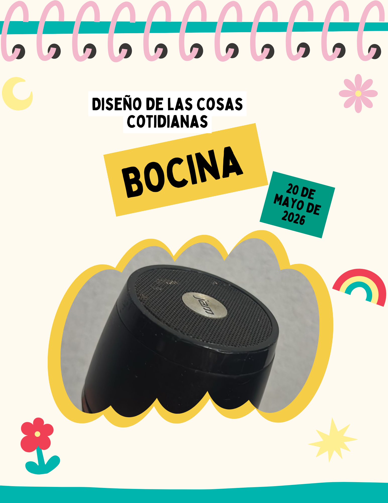
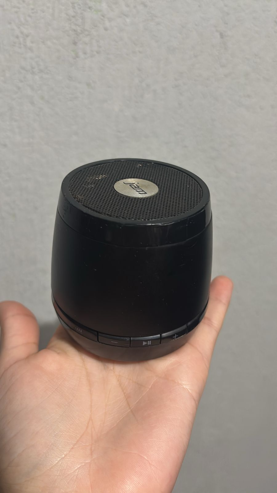

# Entrada 03: Bocina portátil

## Categoría

Diseño de las cosas cotidianas

## Fecha de observación

20 de mayo de 2026

## Objeto analizado

Bocina portátil marca Jam.

## Contexto

Esta bocina portátil tiene un diseño compacto pero al momento de usarla me di cuenta que los controles están demasiado escondidos.

Los botones para subir volumen, bajar volumen y pausar la música están colocados en la parte inferior de la bocina y son difíciles de ver cuando el dispositivo está en uso.

Además, la bocina no muestra de ninguna forma el nivel actual de volumen, por lo que muchas veces no sé si está en volumen bajo, medio o alto hasta escuchar el sonido.

## Problema identificado

El principal problema es que los controles importantes no son visibles.

Cuando quiero cambiar el volumen o pausar una canción, tengo que girar la bocina o buscar los botones manualmente porque no se distinguen bien a simple vista.

También considero que la falta de retroalimentación sobre el nivel de volumen hace que la experiencia sea poco clara.

## Principios de diseño relacionados

### Visibilidad

SComo dice Don Norman, las funciones principales deberían ser fáciles de encontrar y entender. En esta bocina, los controles están ocultos y no destacan visualmente.

### Retroalimentación

El sistema no proporciona información que sea fácil de ver sobre el volumen actual. Esto hace que no tenga certeza del estado del volumen del dispositivo hasta escuchar el cambio.

## Reflexión

Para mí esta bocina es un ejemplo de cómo hacer algo compacto afecta la experiencia cuando no se realiza bien. Hay bocinas más compactas que indican el nivel de volumen, el problema recae totalmente en el diseño. 

Creo que los controles principales deberían ser mucho más visibles porque son funciones que el usuario utiliza constantemente.

## Posible mejora

Poner los botones en una zona más visible y diferenciarlos mejor con tamaño o iluminación.

También agregar alguna forma de indicar el nivel de volumen, como luces LED.