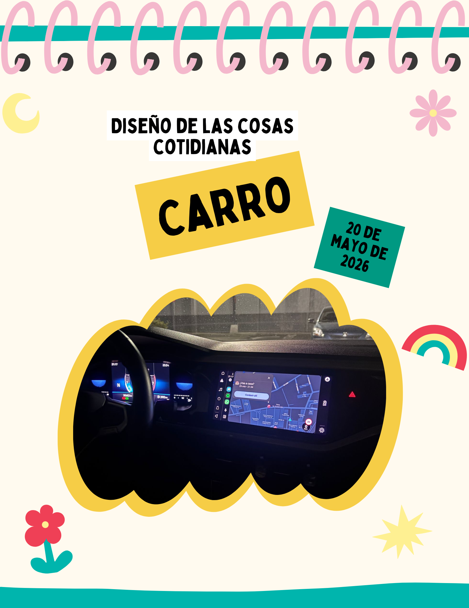
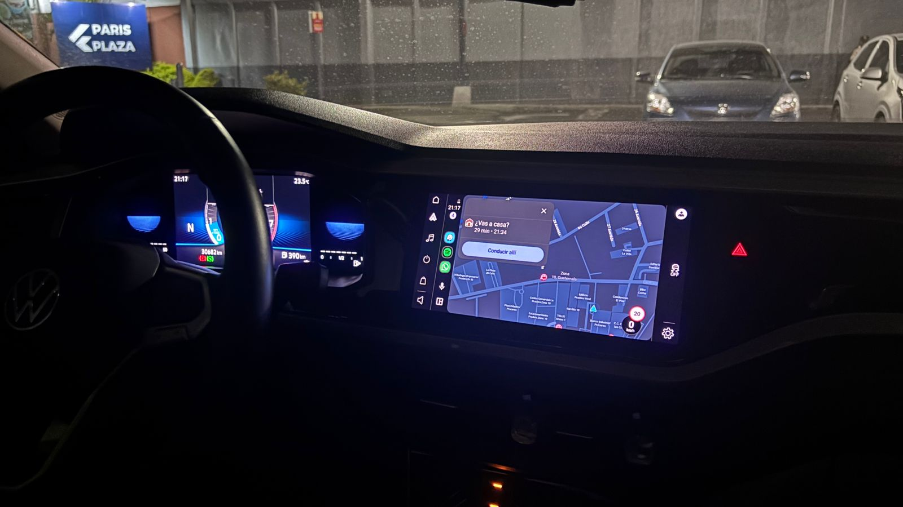

# Entrada 04: Luz de emergencia en carro

## Categoría

Diseño de las cosas cotidianas

## Fecha de observación

20 de mayo de 2026 

## Objeto analizado

Botón de luces de emergencia en un carro.

## Contexto

En este carro, el botón de las luces de emergencia se encuentra colocado muy lejos del conductor, específicamente hacia el centro derecho del tablero.

Zl manejar me di cuenta que alcanzar el botón rápidamente es incómodo porque debo estirarme para llegar a él.

Esto se vuelve más evidente cuando necesito activar las luces de emergencia de manera rápida o en una situación inesperada.

## Problema identificado

El principal problema es la ubicación del botón de emergencia. Las luces de emergencia son una función importante relacionada con seguridad, por lo que deberían ser fáciles de alcanzar sin quitar demasiada atención del camino.

En este diseño el conductor necesita mover el brazo y apartar parcialmente la vista para presionar el botón.

Además, el botón está rodeado de mucho espacio vacío, por lo que parece que pudo haberse colocado en una posición más accesible.

## Principios de diseño relacionados

### Visibilidad

Para Don Norman las funciones importantes deben ser visibles y fáciles de localizar. Aunque el botón tiene un símbolo reconocible, su ubicación hace que no sea tan accesible durante el manejo.

El diseño no toma completamente en cuenta la comodidad física del usuario al conducir. Tener que estirarse para llegar al botón puede dificultar una reacción rápida.

En situaciones de estrés o emergencia, el conductor debería poder activar las luces casi automáticamente. 

## Reflexión

Para mí este es un ejemplo de cómo un diseño visual moderno no siempre significa que sea funcional.

El interior del carro se ve limpio y tecnológico, pero la posición del botón de emergencia no parece pensada desde la experiencia real del conductor.

Considero que los controles relacionados con seguridad deberían priorizar rapidez y facilidad de acceso antes que la estética.

## Posible mejora

Una mejora sería colocar el botón de luces de emergencia más cerca del volante.