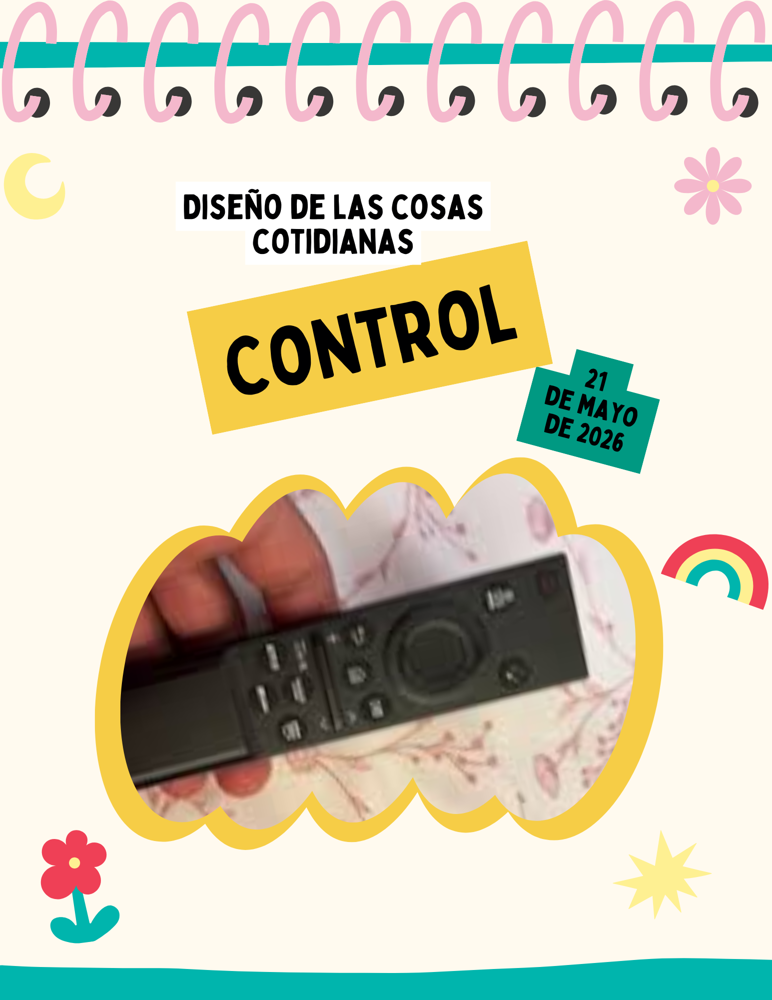
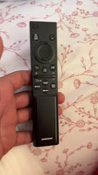

# Entrada 05: Control remoto Samsung

## Categoría

Diseño de las cosas cotidianas

## Fecha de observación

21 de mayo de 2026

## Objeto analizado

Control remoto Samsung para televisión.

## Contexto

Este control tiene un diseño bastante minimalista y moderno, pero al usarlo los botones no son fáciles de entender.

Varios símbolos no explican qué función hacen  y algunos botones tienen íconos pequeños.

## Problema identificado

El principal problema es que no sabes dónde se controlan muchas cosas del propio control.

Muchos botones usan únicamente el botón sin símbolo..

También considero que algunos botones importantes no destacan visualmente, haciendo más difícil encontrarlos rápidamente mientras se usa el televisor.

## Principios de diseño relacionados

### Visibilidad

Para el gran Don Norman un diseño que está bien hace que entender las acciones posibles sea fácil. En este control, varios botones no comunican claramente su función.

Jakob Nielsen dice que los usuarios deberían reconocer las acciones al verlo.

## Reflexión

Considero que un control debería priorizar claridad y facilidad de uso, especialmente porque es un objeto que se utiliza constantemente.

## Posible mejora

Una mejora sería agregar etiquetas más claras o íconos más fáciles de entender para las funciones.

También ayudaría diferenciar visualmente ciertos botones importantes utilizando colores.