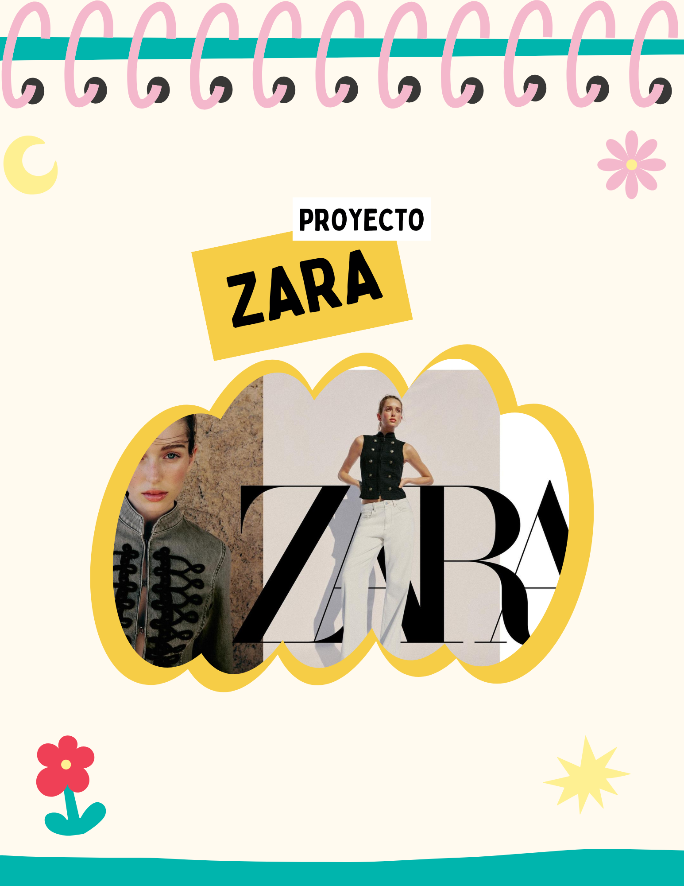

# Proyecto: Reflexiones sobre el desarrollo del prototipo de Zara

---

# Entrada 01: Qué me pareció bien del objetivo del proyecto

## Fecha

[21/05/2026]

## Reflexión

Me pareció muy buena idea trabajar sobre una página web ya existente en lugar de crear una completamente desde cero. Muchas veces uno piensa que porque una página pertenece a una marca grande significa que ya está perfectamente diseñada, pero no siempre es así. 

Todos ya conocíamos cómo funciona Zara y eso hacía más fácil identificar problemas de usabilidad, accesibilidad y experiencia de usuario. 

También me gustó que el proyecto no consistía únicamente en criticar la página, sino en proponer mejoras reales basadas en observaciones y datos obtenidos durante las pruebas. Eso hizo que el trabajo tuviera más sentido y que realmente pensáramos como diseñadores de experiencia de usuario.

Considero que escoger Zara fue una buena decisión porque es una plataforma muy utilizada.

---
