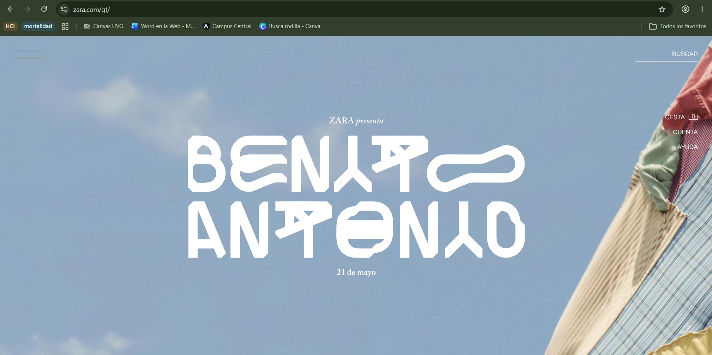
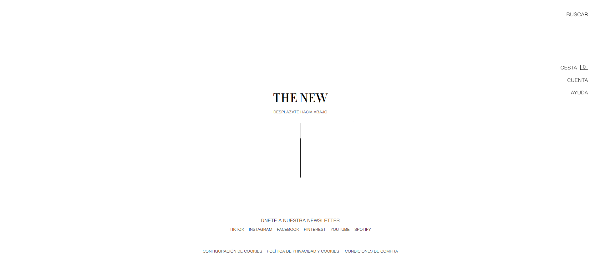
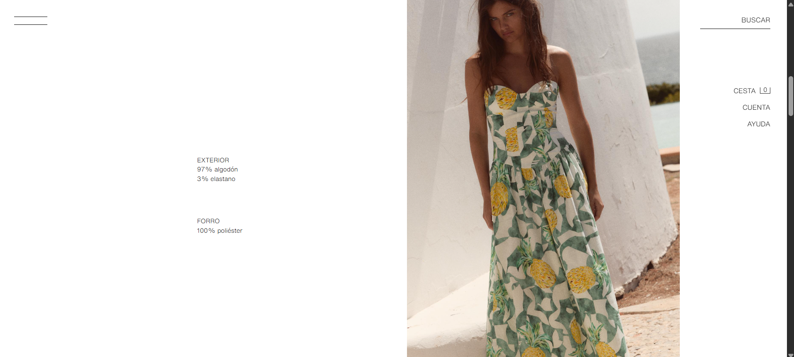
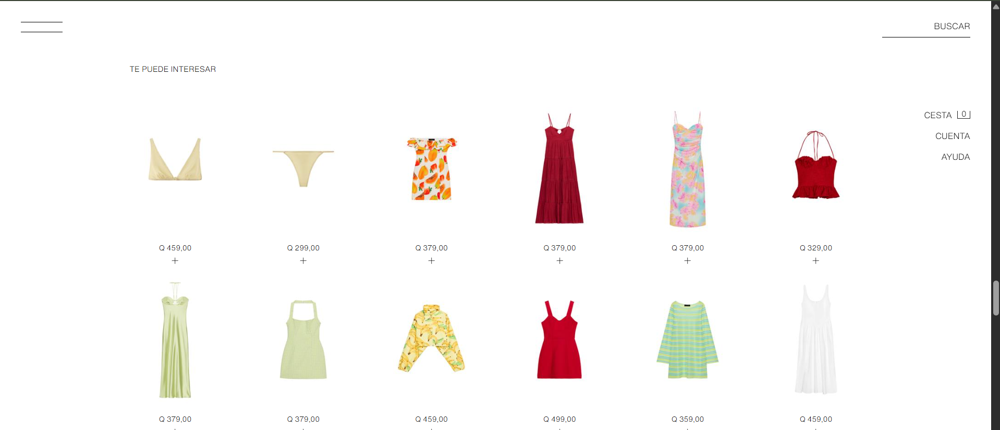
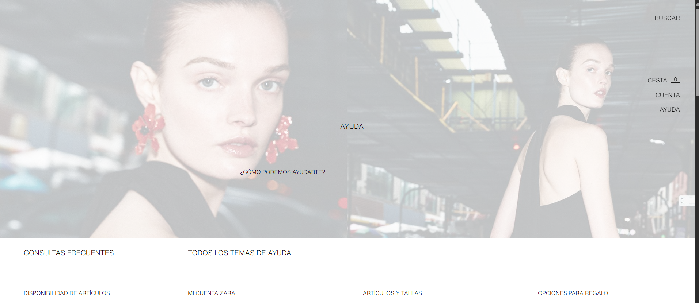

# Entrada 01: Sitio web de Zara 

## Categoría

Usabilidad

## Fecha de observación

20 de mayo de 2026

## Interfaz analizada

Sitio web de Zara Guatemala.

## Contexto

Para esta entrada analicé la página web de Zara, específicamente su página principal, navegación, vista de producto, recomendaciones y sección de ayuda.

A simple vista, el sitio tiene una estética muy limpia y minimalista. Sin embargo, al usarlo, noté que varias decisiones visuales hacen que la navegación sea confusa.

El diseño parece priorizar la apariencia visual sobre la facilidad de uso.

## Problema identificado

El principal problema es que la página no guía claramente al usuario. Muchos elementos importantes, como el menú, la búsqueda, la cesta, la cuenta y ayuda, aparecen pequeños, separados o con poco contraste.

También hay mucho espacio vacío y algunas secciones requieren que el usuario explore sin saber exactamente qué encontrará. Esto puede hacer que comprar o encontrar información sea más lento de lo necesario.

## Principios de usabilidad 

### 1. Visibilidad del estado del sistema

El sitio no siempre deja claro dónde está el usuario ni qué está pasando. Por ejemplo, en algunas pantallas hay mucho espacio vacío y pocos indicadores de ubicación o progreso.

### 2. Relación entre el sistema y el mundo real

Algunas decisiones visuales no se sienten naturales para una tienda en línea. Una página de compras normalmente debería mostrar productos, categorías o caminos claros para explorar, pero Zara utiliza una navegación más editorial y abstracta.

### 3. Control y libertad del usuario

El usuario puede sentirse perdido porque no hay rutas claras para regresar, filtrar o navegar rápidamente entre categorías. El menú existe, pero no siempre se percibe como una guía suficiente.

### 4. Consistencia y estándares

La página rompe con varios estándares comunes de tiendas en línea. Por ejemplo, la información del producto, la búsqueda y la navegación no tienen la misma prioridad visual que en otras páginas de comercio electrónico.

### 5. Prevención de errores

Al no mostrar claramente categorías, filtros o caminos de navegación, el usuario puede entrar a secciones equivocadas o tardar más en encontrar lo que busca.

### 6. Reconocimiento antes que memoria

El sitio obliga al usuario a recordar dónde estaban ciertas opciones o a explorar por ensayo y error. Los elementos importantes no siempre son evidentes a simple vista.

### 7. Flexibilidad y eficiencia de uso

Para usuarios nuevos, la página puede ser lenta de entender. Para usuarios frecuentes, también puede ser poco eficiente porque encontrar productos específicos requiere varios pasos o mucha exploración visual.

### 8. Diseño estético y minimalista

Aunque el sitio cumple con una estética minimalista, en este caso el minimalismo parece afectar la claridad. Hay demasiado espacio vacío y poca jerarquía visual en elementos importantes.

### 9. Ayudar a reconocer, diagnosticar y recuperarse de errores

La página no ofrece suficiente apoyo cuando el usuario no encuentra lo que busca. La sección de ayuda existe, pero no se siente integrada de forma clara al proceso de navegación o compra.

### 10. Ayuda y documentación

Aunque Zara tiene una sección de ayuda, llegar a información específica puede no ser tan directo. La página depende mucho de que el usuario sepa qué buscar o dónde hacer clic.

## Reflexión

Para mí, la página de Zara demuestra que un diseño bonito no siempre significa que sea fácil de usar.

Visualmente se ve elegante, pero como tienda en línea puede resultar confusa porque muchas acciones importantes no están suficientemente destacadas.

Considero que el sitio busca parecer moderno y editorial, pero eso hace que la experiencia de compra sea menos directa.

## Posible mejora

Una mejora sería dar más jerarquía visual a las acciones principales, como buscar, ver categorías, filtrar productos, revisar tallas y acceder a ayuda.

También podrían reducir espacios vacíos en las pantallas y mostrar rutas de navegación o para regresar. 