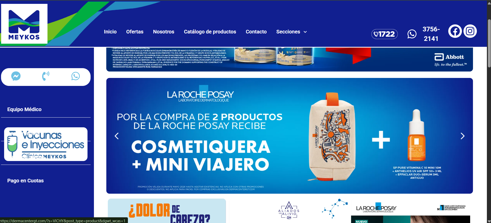
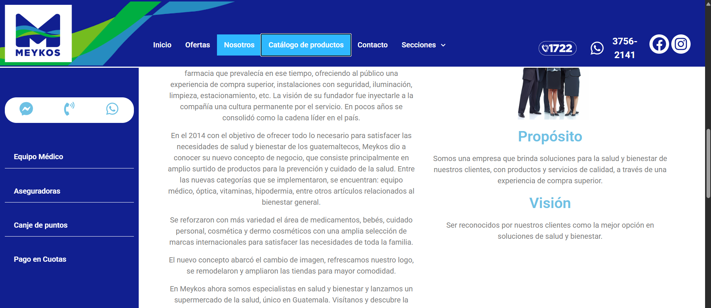
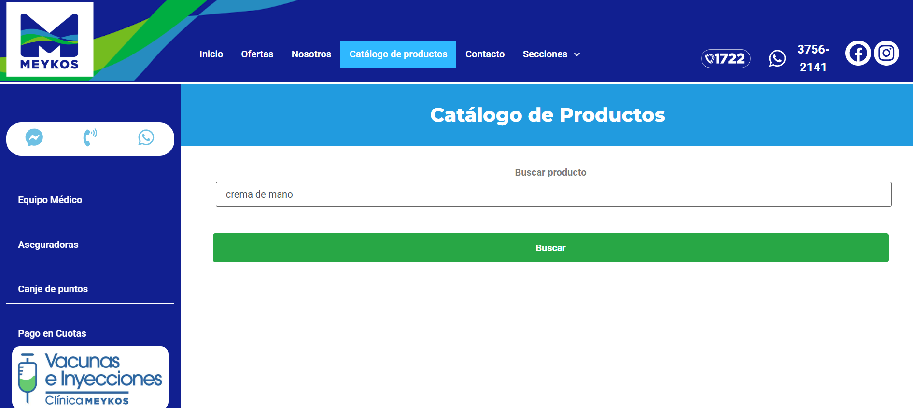
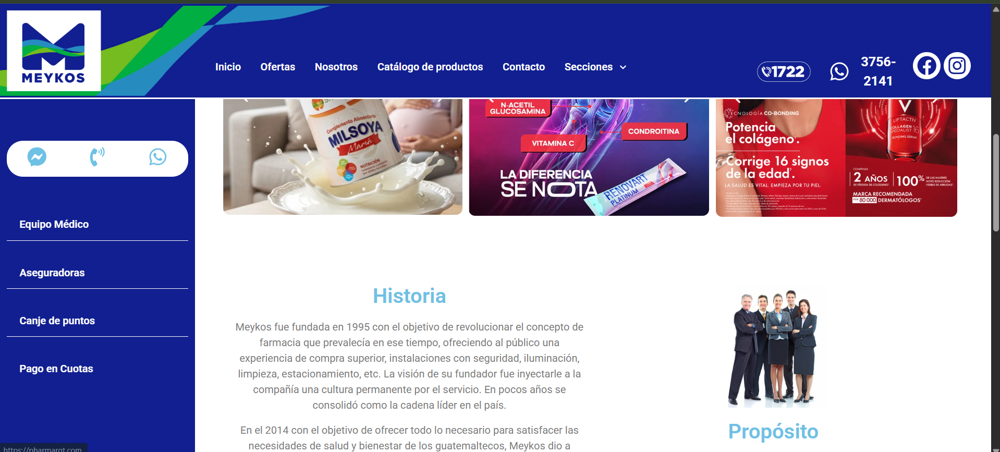

# Entrada 02: Sitio web de Meykos

## Categoría

Usabilidad

## Fecha de observación

20 de mayo de 2026

## Interfaz analizada

Sitio web de Meykos Guatemala.

## Contexto

Para esta entrada analicé distintas secciones de la página web de Meykos, incluyendo el menú principal, el catálogo de productos, la búsqueda y la sección de ofertas.

## Problema identificado

Uno de los principales problemas es el contraste visual. En el menú lateral izquierdo existen opciones como “Aseguradoras” y “Canje de puntos”, pero las letras son blancas y se mezclan con el fondo blanco de las imágenes promocionales, haciendo que prácticamente no se vean.

También noté errores de navegación. Por ejemplo, al entrar al catálogo de productos aparece seleccionado tanto “Catálogo de productos” como “Nosotros”, lo cual genera confusión sobre la sección actual.

Además, cuando busqué un producto que no existía, la página simplemente mostró un espacio vacío en lugar de indicar que no se encontraron resultados.

La sección de “Ofertas” lleva al usuario hacia la sección de historia de la empresa, lo cual no coincide con lo que uno espera encontrar.

## Principios de usabilidad relacionados

### 1. Visibilidad del estado del sistema

La página no comunica claramente qué sección está activa. En algunas pantallas aparecen varios botones resaltados al mismo tiempo, confundiendo al usuario.

### 2. Relación entre el sistema y el mundo real

Cuando un usuario entra a “Ofertas”, espera ver promociones o descuentos. Sin embargo, la página lo dirige hacia otra sección distinta, rompiendo las expectativas naturales del usuario.

### 3. Control y libertad del usuario

Cuando la búsqueda no encuentra productos, la página simplemente queda vacía. Esto hace que el usuario no sepa si ocurrió un error o si realmente no existen resultados.

### 4. Consistencia y estándares

El comportamiento del menú y de las secciones no es consistente. Tener dos opciones seleccionadas al mismo tiempo rompe un estándar común de navegación web.

### 5. Prevención de errores

El diseño visual del menú lateral provoca errores porque algunas opciones prácticamente desaparecen debido al mal contraste con el fondo.

### 6. Reconocimiento antes que memoria

Los usuarios deben recordar dónde están ciertas opciones porque algunas no son visibles correctamente en ciertas partes de la página.

### 7. Flexibilidad y eficiencia de uso

Buscar productos se vuelve menos eficiente cuando el sistema no ofrece mensajes claros ni sugerencias relacionadas al no encontrar resultados.

### 8. Diseño estético y minimalista

Aunque la página intenta verse moderna y colorida, algunas decisiones visuales afectan la claridad de los elementos importantes, especialmente el texto blanco sobre fondos claros.

### 9. Ayudar a reconocer, diagnosticar y recuperarse de errores

La página no ayuda al usuario cuando algo falla. Por ejemplo, en la búsqueda no aparece un mensaje como “producto no encontrado” o sugerencias similares.

### 10. Ayuda y documentación

No existe suficiente orientación visual para explicar al usuario qué ocurrió cuando una acción no funciona como esperaba.

## Reflexión

Esta página de la farmacia MEYKOS demuestra cómo errores de diseño pueden afectar bastante la experiencia del usuario.

Muchas veces las páginas web se enfocan en agregar imágenes, colores y promociones, pero olvidan aspectos básicos como contraste, navegación clara y retroalimentación.

## Posible mejora

Una mejora importante sería aumentar el contraste de las opciones del menú lateral para que siempre sean visibles independientemente del fondo.

También sería útil corregir la navegación entre secciones, mostrar solamente el botón activo y agregar mensajes claros cuando una búsqueda no encuentre productos.