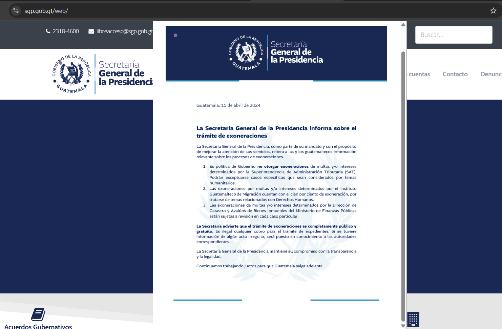
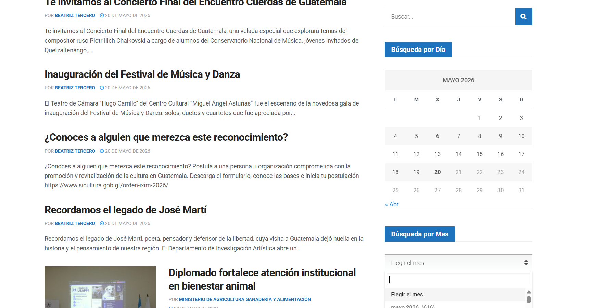

# Entrada 03: Sitio web del Gobierno de Guatemala

## Categoría

Usabilidad

## Fecha de observación

21 de mayo de 2026

## Interfaz analizada

Sitios web del Gobierno de Guatemala.

## Contexto

Analicé el portal del Gobierno de Guatemala y observé distintos problemas relacionados con navegación, consistencia y retroalimentación.

## Problema identificado

Uno de los principales problemas es que el menú superior desaparece cuando el usuario hace scroll hacia abajo. Esto obliga a volver a subir toda la página para acceder nuevamente a la navegación principal.

También noté que algunos nombres dentro de los menús no se muestran completos, por lo que el usuario no puede leer correctamente ciertas opciones.

Además, varios enlaces abren nuevas pestañas automáticamente en lugar de mantenerse dentro de la misma ventana. Esto provoca que rápidamente se acumulen muchas pestañas abiertas y hace más difícil mantener la navegación organizada.

Otro problema importante es que algunos archivos se abren como preview dentro de la página, pero luego ya no existe una forma clara de regresar a la vista anterior sin recargar completamente el sitio.

Finalmente, en la sección de búsqueda por mes, el selector no permite escribir ni desplazarse correctamente para elegir otros meses, dejando prácticamente bloqueada la función.

## Principios de usabilidad relacionados

### 1. Visibilidad del estado del sistema

Cuando el menú desaparece al hacer scroll, el usuario pierde acceso visible a la navegación principal y puede sentirse desorientado dentro del sitio.

### 2. Relación entre el sistema y el mundo real

Los usuarios esperan que una página gubernamental tenga navegación clara y estable. Abrir múltiples pestañas automáticamente rompe esa expectativa natural de navegación.

### 3. Control y libertad del usuario

El sistema no le da suficiente control al usuario. Por ejemplo, después de abrir ciertos archivos en preview, regresar se vuelve complicado y muchas veces obliga a recargar la página.

### 4. Consistencia y estándares

Abrir enlaces en nuevas ventanas constantemente rompe un estándar común de navegación web. También hay inconsistencias entre cómo funcionan distintas secciones del sitio.

### 5. Prevención de errores

Los nombres cortados dentro de los menús pueden hacer que el usuario seleccione opciones incorrectas o no entienda completamente qué sección está visitando.

### 6. Reconocimiento antes que memoria

Al desaparecer el menú principal, el usuario debe recordar dónde estaban las opciones de navegación o regresar manualmente hasta arriba.

### 7. Flexibilidad y eficiencia de uso

La navegación se vuelve poco eficiente porque acciones simples como regresar, buscar o cambiar de sección requieren pasos adicionales innecesarios.

### 8. Diseño estético y minimalista

Aunque algunas páginas intentan mantener una estructura limpia, ciertos elementos terminan sacrificando funcionalidad, como menús poco visibles o textos incompletos.

### 9. Ayudar a reconocer, diagnosticar y recuperarse de errores

Cuando una búsqueda no funciona correctamente o el usuario queda atrapado en un preview, el sistema no ofrece suficiente ayuda para corregir el problema fácilmente.

### 10. Ayuda y documentación

El sitio no guía claramente al usuario sobre cómo navegar ciertas funciones complejas, especialmente documentos, previews y filtros de búsqueda.

## Reflexión

Una página tan importante como la del gobierno es difícil de entender, es ta cuenta con mucha información mal organizada.

Las páginas gubernamentales se enfocan únicamente en publicar contenido, pero no en cómo las personas realmente interactúan con ese contenido.

Con los aprendizajes que hemos tenido en HCI esto podría mejorar. 

## Posible mejora

Mantener el menú visible mientras el usuario hace scroll para facilitar la navegación constante dentro del sitio.

También sería útil corregir los menús con texto incompleto, evitar abrir nuevas pestañas automáticamente y mejorar el sistema de previews para que los y las guatemaltecas puedan regresar fácilmente a la página anterior.
