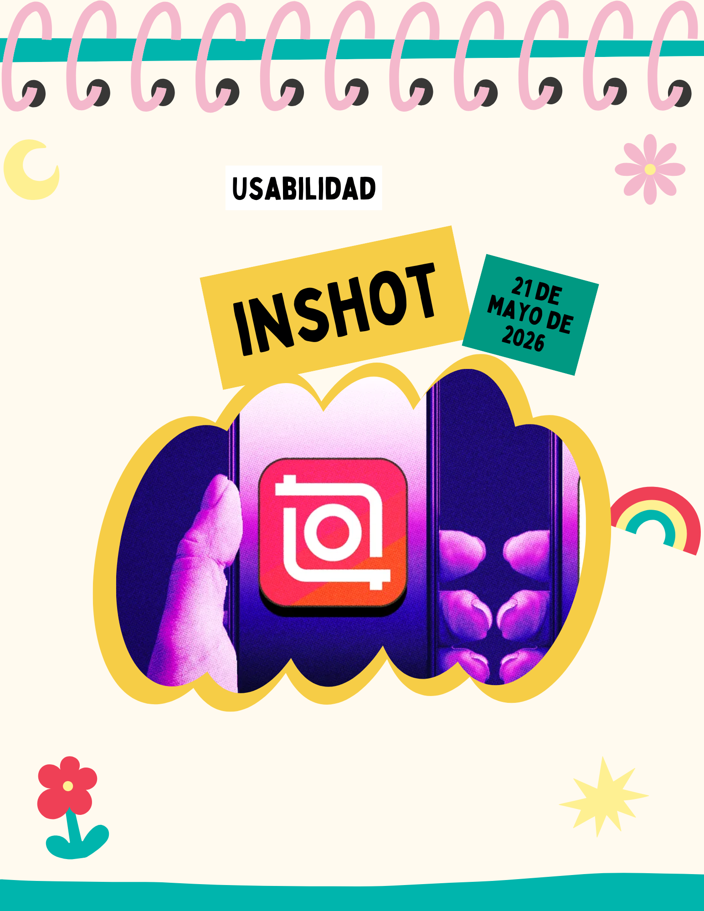
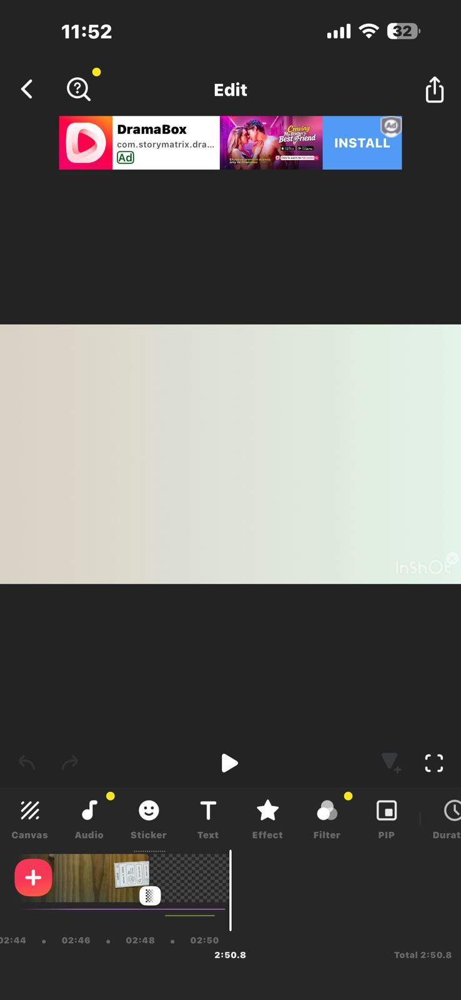
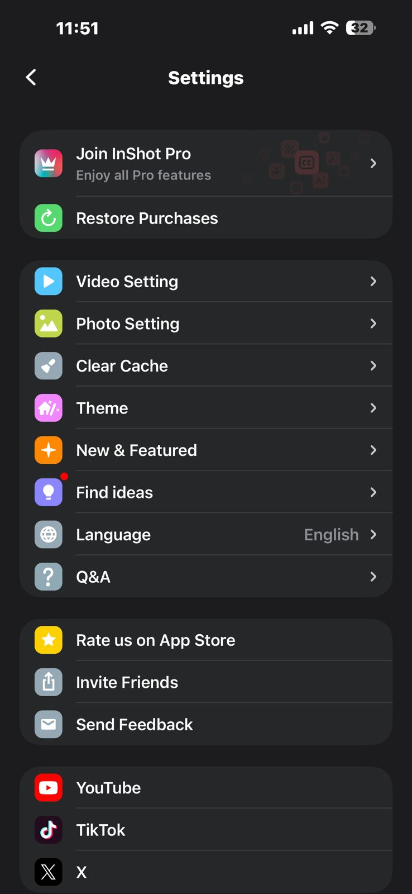
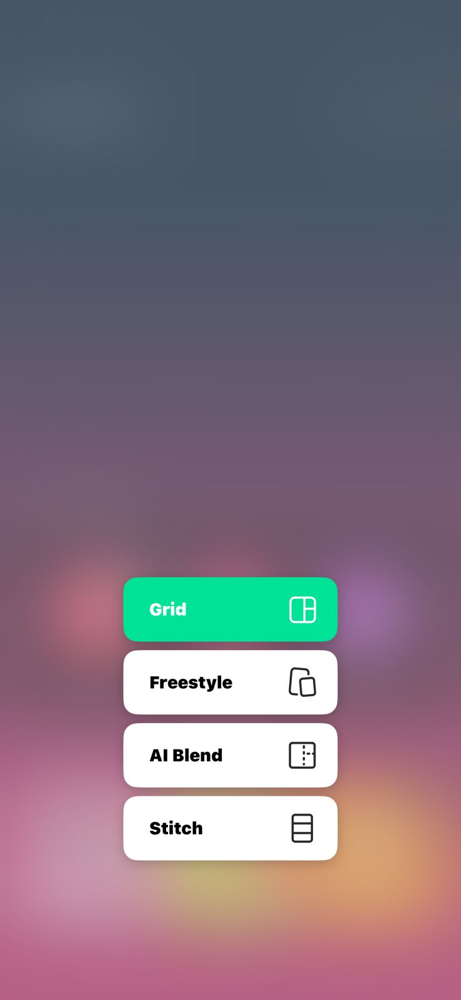

# Entrada 05: Aplicación InShot y problemas de usabilidad

## Categoría

Usabilidad

## Fecha de observación

21 de mayo de 2026

## Interfaz analizada

Aplicación móvil InShot para edición de video.

## Contexto

Para esta entrada analicé distintas pantallas de la aplicación InShot, incluyendo la pantalla principal, opciones de collage, configuración y edición de video.

Hay problemas relacionados con navegación, organización y descubrimiento de funciones importantes.

## Problema identificado

Uno de los principales problemas es que los drafts o proyectos guardados no son visibles desde la pantalla principal. Para encontrarlos, tengo que manualmente entrar a configuración, lo cual no es algo intuitivo para una función tan importante.

También considero que algunas herramientas están demasiado escondidas entre muchos íconos y menús pequeños.

## Principios de usabilidad relacionados

### 1. Visibilidad del estado del sistema

Los drafts no son visibles fácilmente desde el inicio de la aplicación. Esto hace que el usuario no tenga claridad sobre dónde están sus proyectos guardados.

### 2. Relación entre el sistema y el mundo real

La mayoría de aplicaciones de edición suelen mostrar proyectos recientes directamente en la pantalla principal. En este caso, la ubicación de los drafts no coincide con esa expectativa natural.

### 3. Control y libertad del usuario

El usuario pierde facilidad de acceso a sus propios proyectos porque necesita navegar hasta configuración para encontrarlos.

### 4. Consistencia y estándares

Ocultar drafts dentro de settings rompe un estándar común de aplicaciones de edición de video, donde normalmente los proyectos recientes aparecen primero.

### 5. Prevención de errores

Al no mostrar claramente los proyectos guardados, el usuario puede pensar que perdió su trabajo o que no se guardó correctamente.

### 6. Reconocimiento antes que memoria

La aplicación obliga al usuario a recordar dónde están los drafts en lugar de mostrarlos de forma visible e intuitiva.

### 7. Flexibilidad y eficiencia de uso

La navegación se vuelve menos eficiente porque tareas frecuentes, como abrir un proyecto anterior, requieren pasos innecesarios.

### 8. Diseño estético y minimalista

Aunque la aplicación tiene un diseño moderno y atractivo, algunos elementos visuales y promociones premium terminan ocultando funciones importantes.

### 9. Ayudar a reconocer, diagnosticar y recuperarse de errores

Cuando un usuario no encuentra sus drafts, la aplicación no ofrece suficiente orientación para ayudarle a localizarlos rápidamente.

### 10. Ayuda y documentación

La aplicación no explica claramente dónde se almacenan los proyectos recientes ni cómo acceder fácilmente a ellos.

## Reflexión

Para mí, InShot es un ejemplo de cómo una aplicación puede tener buenas funciones pero aun así presentar problemas de organización.

Visualmente algunas decisiones de navegación hacen que acciones básicas sean difíciles. 

## Posible mejora

Agregar una sección visible de “proyectos recientes” o “drafts” directamente en la pantalla principal.

También sería útil simplificar algunos menús del editor.