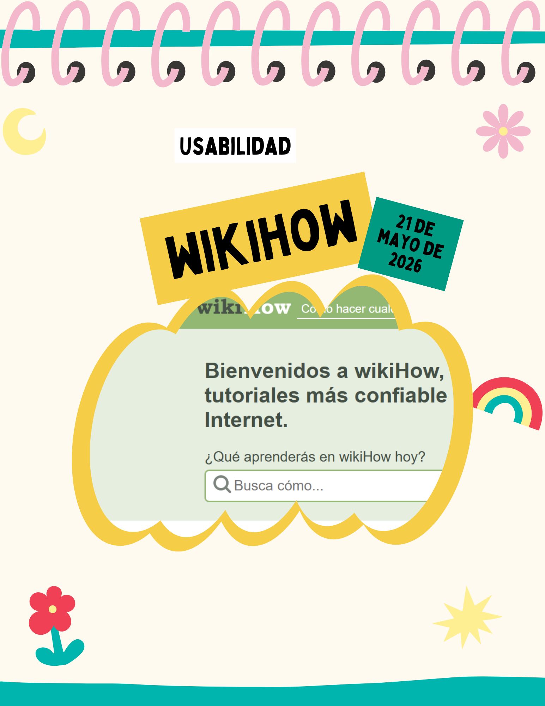
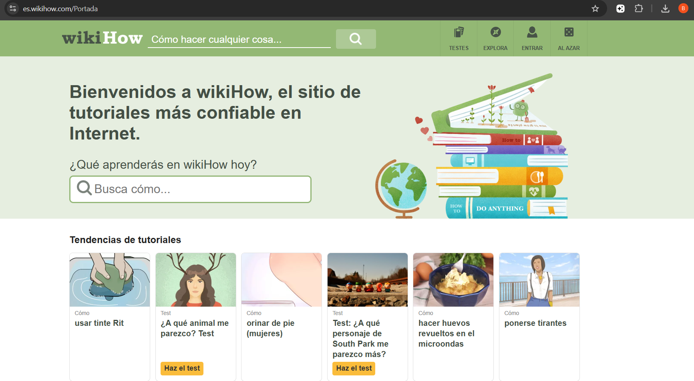
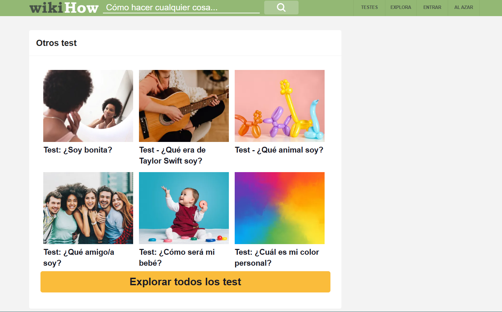
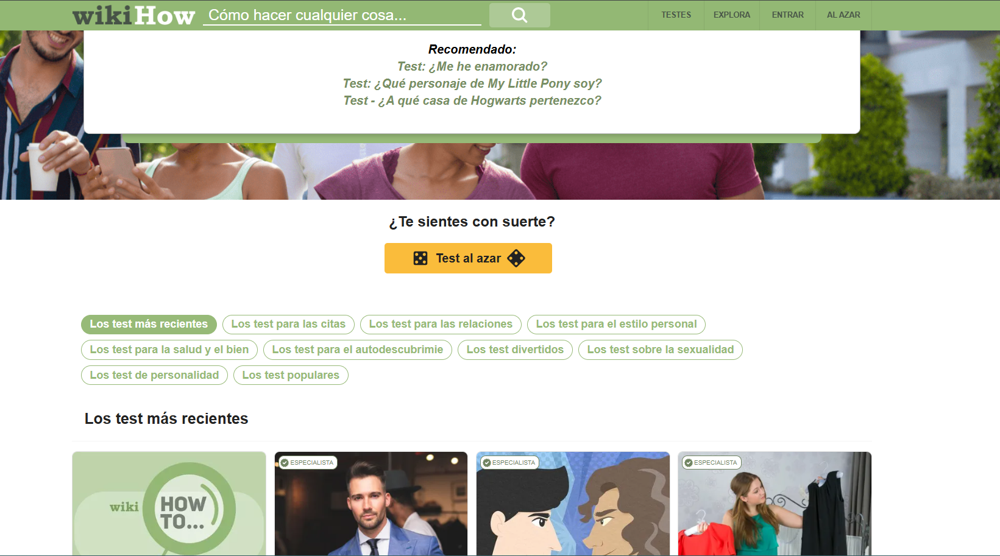

# Entrada 05: wikiHow y problemas de usabilidad

## Categoría

Usabilidad

## Fecha de observación

21 de mayo de 2026

## Interfaz analizada

Sitio web de wikiHow
## Contexto

Para esta entrada analicé distintas secciones de wikiHow, incluyendo la página principal, los apartados de tests y recomendaciones automáticas.

Aunque la página tiene mucha información y tutoriales útiles, encontré varios aspectos que afectan la experiencia del usuario y hacen que la navegación se sienta confusa y curiosa.

## Problema identificado

Uno de los principales problemas es la gran cantidad de contenido mostrado al mismo tiempo. Hay demasiados tests, categorías, recomendaciones y botones en pantalla, lo que puede distraer fácilmente al usuario.

También noté que muchos artículos y tests parecen repetitivos.

## Principios de usabilidad relacionados

### 1. Visibilidad del estado del sistema

La página muestra demasiados elementos simultáneamente y no deja claro cuáles son realmente importantes o recomendados.

### 2. Relación entre el sistema y el mundo real

Muchos títulos de tests y recomendaciones parecen exagerados o poco claros, haciendo que la experiencia se sienta más como publicidad que como ayuda real.

### 3. Control y libertad del usuario

El usuario puede perderse fácilmente entre tantas categorías y recomendaciones, especialmente porque el contenido sigue cargando mientras se baja en la página.

### 4. Consistencia y estándares

Algunas tarjetas utilizan estilos distintos entre sí y ciertos elementos parecen artículos normales mientras otros son tests, pero visualmente se parecen mucho.

### 5. Prevención de errores

La saturación visual puede provocar que el usuario abra contenido equivocado o haga clic en algo distinto a lo que realmente buscaba.

### 6. Reconocimiento antes que memoria

La gran cantidad de categorías obliga al usuario a recordar dónde vio algo anteriormente porque después cuesta volver a encontrarlo.

### 7. Flexibilidad y eficiencia de uso

Aunque existe una barra de búsqueda, navegar manualmente por el contenido puede volverse lento debido a la cantidad excesiva de elementos mostrados.

### 8. Diseño estético y minimalista

La interfaz rompe bastante este principio porque hay demasiados colores, tarjetas, imágenes y recomendaciones en una sola pantalla.

### 9. Ayudar a reconocer, diagnosticar y recuperarse de errores

Cuando el usuario entra a un test o artículo equivocado no hay una navegación clara para regresar fácilmente al contenido anterior relacionado.

### 10. Ayuda y documentación

Aunque wikiHow ofrece mucha información, la organización del contenido podría ser más clara para ayudar al usuario a encontrar rápidamente lo que necesita.

## Reflexión

wikiHow tiene muchísimo contenido, pero la forma en que está organizado hace que la experiencia pueda sentirse algo caótica.

La página intenta mostrar demasiadas cosas al mismo tiempo y eso termina afectando la página visualmente y la facilidad de navegación.

## Posible mejora

Una posible mejora sería reducir la cantidad de tarjetas y categorías visibles en una sola pantalla.

También ayudaría separar más claramente los artículos, los tests y las recomendaciones para evitar confusión.